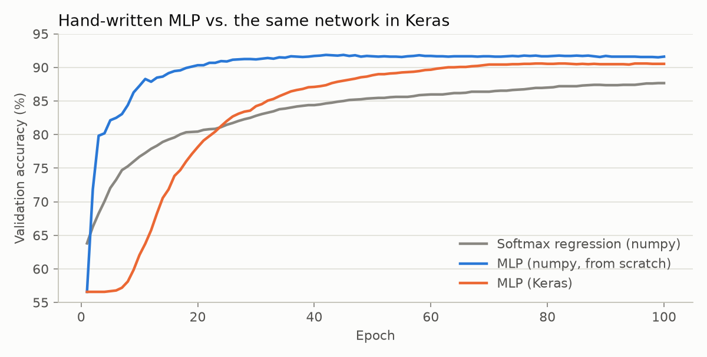

# Neural Network from Scratch

I built a small neural network using only NumPy, without PyTorch, TensorFlow or Keras, because I wanted to see if I could get all the math right myself. I wrote every step by hand including passing the data through the layers, measuring the error, working out how much each weight should change (backpropagation), and updating the weights. The network reads a single sentence and guesses which of three authors wrote it: Arthur Conan Doyle, Fyodor Dostoyevsky or Jane Austen.

To check my work, I built the exact same network in Keras and trained both on the same data, and mine ended up slightly more accurate.

## Results

I used 19,536 sentences from their novels and split them into 70% for training, 10% for validation and 20% for testing. The data is uneven, with 57% of the sentences from Austen, 30% from Dostoyevsky and only 13% from Doyle, which makes Doyle the hardest author to catch.

| Model | Test accuracy | Macro F1 | Doyle sentences caught |
|---|---|---|---|
| Softmax regression (no hidden layer, my code) | 88.5% | 0.80 | 44% |
| **My neural network** | **90.9%** | **0.86** | **70%** |
| Same network in Keras | 90.3% | 0.85 | 67% |

Macro F1 gives each author an equal say in the score, so a good score on Austen can't hide a bad score on Doyle.



The simpler model without a hidden layer mostly guessed Austen, since she makes up more than half the data, and it only found 44% of Doyle's sentences. Adding the hidden layer is what fixed that, bringing Doyle up to 70% while Austen stayed at 95%. My version also learned faster than the Keras one, reaching 90% validation accuracy around epoch 20 while Keras took about 70 epochs, even with a learning rate 10 times higher. I think the difference comes from how the weights start out, since I start them as very small random numbers, which keeps the sigmoid in the range where it learns fastest, while Keras uses a different default called Glorot uniform.

## How it works

The input for each sentence is a TF-IDF vector, which is a list of 11,091 numbers (one for every word in the vocabulary) where a word gets a high value if it shows up in this sentence but is rare in the rest of the data. That goes into a hidden layer of 128 units with a sigmoid activation, and then into an output layer with a softmax that turns the scores into a probability for each author.

Training works by going backwards through the network and figuring out how much each weight contributed to the error. These are the gradient formulas I derived and coded in [`nnscratch/models.py`](nnscratch/models.py), where P is the predicted probabilities, Y is the correct answers, H is the hidden layer output and λ is the regularization strength:

```
dZ2 = (P - Y) / n
dW2 = H^T dZ2 + 2λ W2        db2 = sum of dZ2
dH  = dZ2 W2^T
dZ1 = dH * H * (1 - H)
dW1 = X^T dZ1 + 2λ W1        db1 = sum of dZ1
```

It's easy to get one of these formulas slightly wrong and never notice, because the network will still train, just worse than it should. To make sure mine are right, I wrote a test in [`tests/test_gradients.py`](tests/test_gradients.py) that nudges every weight up and down by a tiny amount, measures how the loss changes, and checks that it matches my formula to within one part in a million.

For the optimizer I used AdaGrad, which gives each weight its own learning rate that shrinks the more that weight gets updated. This works well for text because most words are rare, so the weights tied to rare words don't get many updates, and AdaGrad lets them keep taking bigger steps when they do.

One practical problem was memory. The training data as a normal matrix would be 13,675 rows by 11,091 columns, which is about 1.2 GB, but almost all of it is zeros since each sentence only uses a handful of words. I stored it as a sparse matrix instead, which only keeps the nonzero values and takes a few MB, and wrote the forward and backward passes so they work on it directly.

## Project structure

```
nnscratch/text.py      cleans the text and builds the TF-IDF features
nnscratch/models.py    softmax regression and the neural network, with their gradients
nnscratch/train.py     AdaGrad, the training loop and the evaluation metrics
scripts/authorship.py  trains all three models and saves the results
tests/                 the gradient check
```

## Running it

```bash
pip install -r requirements.txt
pytest tests
python scripts/authorship.py
python scripts/make_figures.py
```

The script expects `data/authors.tsv` with one author and sentence per line, separated by a tab. The sentences come from public domain novels on [Project Gutenberg](https://www.gutenberg.org/).
